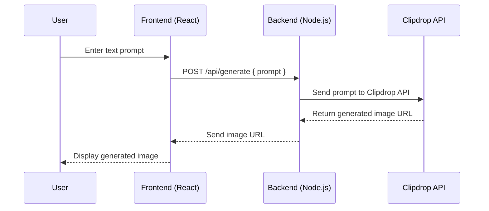

🖼️ Text To Img - AI Image Generator from Text Prompts

**Text To Img** is a full-stack application that lets users generate stunning images from text prompts using the powerful Clipdrop API. Built with a React frontend and Node.js backend, it provides a clean and user-friendly interface to transform imagination into visuals.

---


## 🚀 Features

- ✨ Generate high-quality images from text prompts using Clipdrop API
- ⚛️ React-based frontend for a smooth user experience
- 🔧 Node.js/Express backend to handle API requests securely
- 📁 History of generated images (optional feature)
- 🌐 Responsive design for mobile and desktop
- 💰 (Optional) Credit-based system or API usage limit

---

## 📊 Sequence Diagram - Text to Img



---

## 🧰 Tech Stack

| Frontend     | Backend      | API/Services    | DataBase        |
|--------------|--------------|-----------------|-----------------|
| React.js     | Node.js      | Clipdrop API    |MongoDb          |
| CSS          | Express.js   | dotenv          |MongoShell       |
|              |              | Vercel / Render |                 |


---

## ⚙️ Installation

### 1. Clone the Repository
```bash
git clone https://github.com/DevanshiGupta15/TexttoImg
cd TexttoImg
```

### 2. Set Up Backend
```bash
cd backend
npm install
# Create a .env file and add your Clipdrop API key
echo "CLIPDROP_API_KEY=2527f5dfc417a7acdbf267a8aba1c4c0f5c2a9ac4311e1aeb2496c802c4ec3ae86d26c408f92b28ecf0546e212e5db21" > .env
npm start
```

### 3. Set Up Frontend
```bash
cd ../frontend
npm install
npm start
```

---

## 🌐 API Usage (Backend)

The backend exposes a single POST route:

```
POST /api/generate
Body: {
  prompt: "a futuristic cityscape at night"
}
```

The server sends the prompt to the Clipdrop API and returns the generated image URL.

---

## 📁 Project Structure

```
TexttoImg/
│
├── frontend/          # React app
│   ├── src/
│   ├── public/
│   └── ...
│
├── backend/           # Node.js server
│   ├── routes/
│   ├── controllers/
│   └── ...
```


## 🛡️ Environment Variables

Create a `.env` file in the `backend/` directory:

```env
CLIPDROP_API_KEY=your_clipdrop_api_key
```


## 💡 Future Enhancements

- User authentication and image history
- Download/share generated images
- Multiple image styles (e.g., anime, photorealistic)
- API usage tracking

---

## 🙌 Acknowledgements

- [Clipdrop API](https://clipdrop.co/apis) for image generation
- [React.js](https://react.dev/)
- [Express.js](https://expressjs.com/)

---

## 🤝 Connect

Built with ❤️ by [Devanshi Gupta](https://github.com/DevanshiGupta15/TexttoImg)
